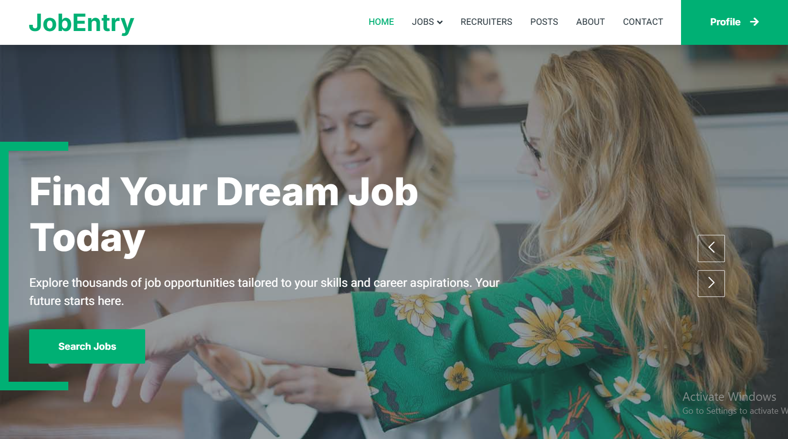
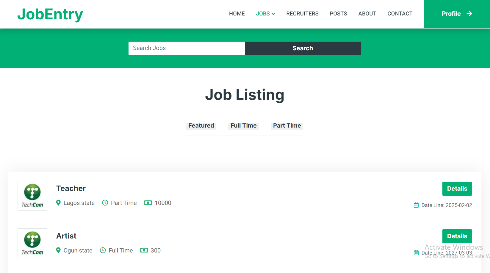
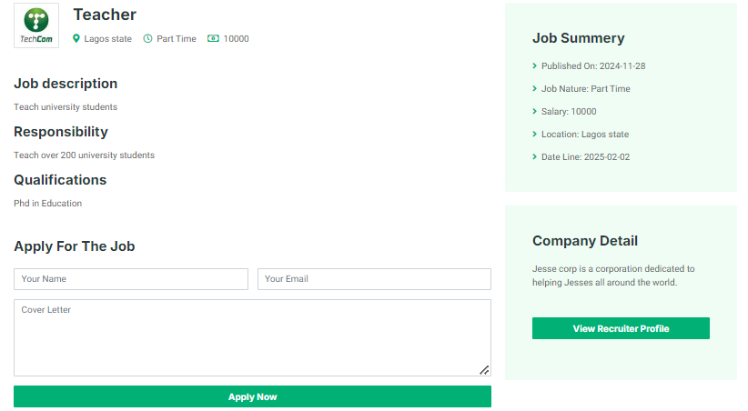
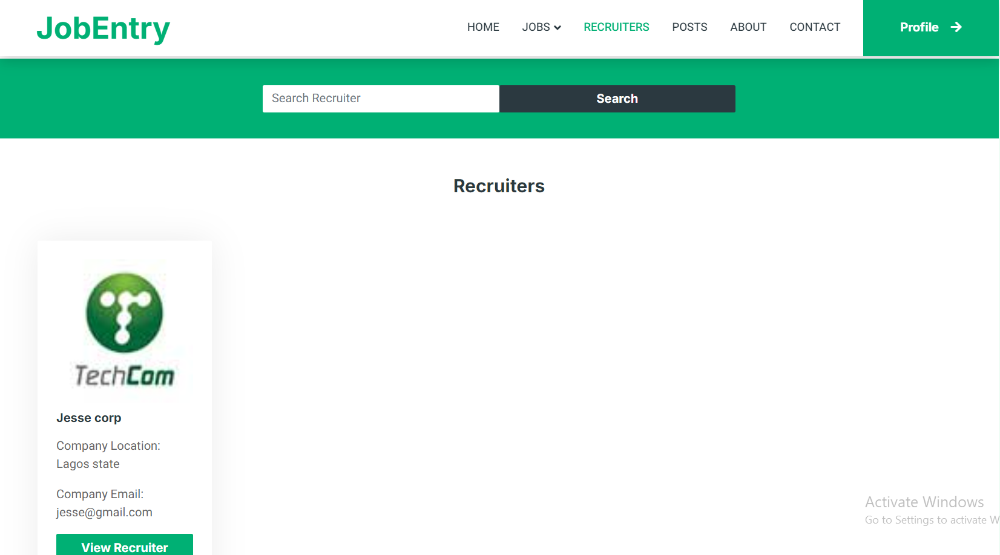
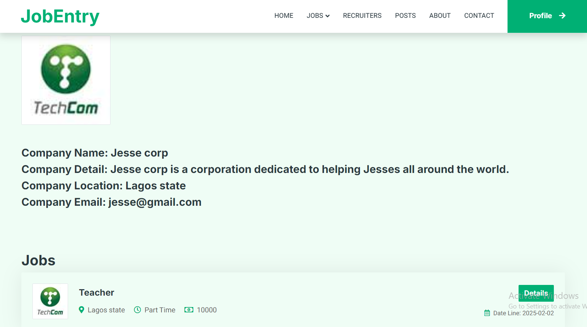
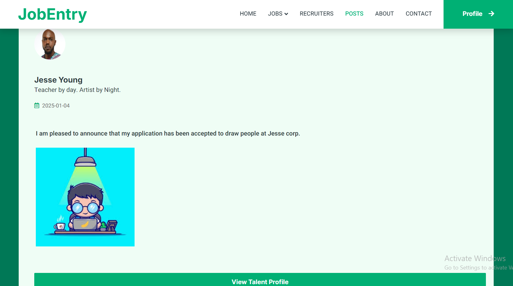

---

# 💼 JobEntry

**Bridging the gap between Recruiters and Talents in Nigeria.**

JobEntry is a dynamic job portal designed to alleviate the high unemployment rate in Nigeria. It creates a direct pipeline between employers and job seekers, removing barriers to entry and simplifying the recruitment process. Beyond just job listings, it fosters a community where talents can share thoughts and engage with recruiters socially.

## 📖 The Solution

JobEntry streamlines the hiring lifecycle:

* **For Recruiters:** It provides a centralized dashboard to manage job openings and screen applicants efficiently.
* **For Talents:** It offers a transparent platform to apply for jobs, track application statuses in real-time, and network through community posts.

## 📸 Screenshots


 


 

## ✨ Key Features

### 🏢 For Recruiters

* **Job Management:** Post, edit, and delete job listings.
* **Flexibility:** Categorize jobs as **Full-time** or **Part-time**.
* **Applicant Tracking:** View a list of all applicants for specific roles.
* **Selection:** Review cover letters and select the best candidates for the job.

### 👨‍💻 For Talents

* **Job Board:** Browse and search through available job listings.
* **Easy Application:** Apply directly using a cover letter.
* **Application Dashboard:** Track the status of every application (Pending, Accepted, Rejected).
* **Control:** Withdraw applications if they are no longer interested.
* **Social Hub:** Compose and share posts visible to recruiters and other talents to showcase expertise or thoughts.

## 🛠️ Tech Stack

* **Backend:** PHP (Native)
* **Frontend:** HTML5, CSS3, JavaScript, Bootstrap (Responsive Design)
* **Database:** MySQL (Managed via phpMyAdmin)

## 🚀 Installation & Setup

To run JobEntry locally, you need a local server environment like **XAMPP**, **WAMP**, or **MAMP**.

1. **Clone the Repository**
Navigate to your local server's root directory (e.g., `htdocs` or `www`).
```bash
git clone https://github.com/Otormin/JobEntry.git

```


2. **Database Configuration**
* Open **phpMyAdmin** in your browser (`http://localhost/phpmyadmin`).
* Create a new database named `jobentry` (check the SQL file for the exact name).
* Import the SQL file found in the root of the project folder.


3. **Connect the App**
* Locate the database connection file (usually `db.php`, `config.php`, or `connect.php`).
* Ensure the credentials match your local setup:
```php
$host = "localhost";
$user = "root";
$pass = ""; // Default XAMPP password is empty
$dbname = "jobentry";

```


4. **Launch**
Open your browser and visit: `http://localhost/JobEntry`